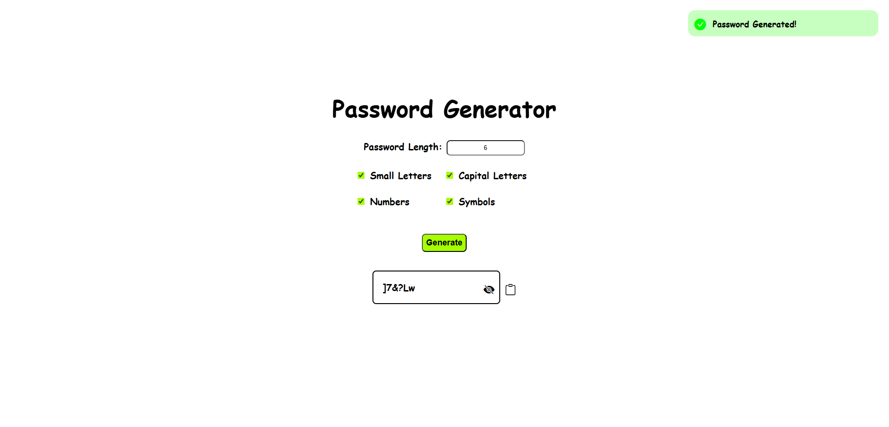

# Password Generator 🔒

A simple and interactive JavaScript password generator that creates secure passwords based on user-selected criteria. Users can choose to include lowercase letters, uppercase letters, numbers, and symbols. The project focuses on DOM manipulation, event handling, string logic, and user feedback through popup notifications.

## Features ✨

- Generate random passwords instantly
- Customizable character options:
  - Lowercase letters
  - Uppercase letters
  - Numbers
  - Symbols
- Popup notifications for user feedback:
  - Error when no character type is selected
  - Success message when a password is generated
  - Confirmation when password is copied
- Dynamic UI updates using JavaScript
- Clean and beginner-friendly code structure
- Copy-to-clipboard functionality

## Key Concepts Used 🧩

- DOM selection `document.getElementById()`
- Event Handling `.addEventListener()` `.click()`
- Reading and updating values `.value` `.checked` `.textContent`
- Conditional logic `if / else`
- Styling with JavaScript `style.display`
- Regular expressions `RegExp`
- String manipulation `.replaceAll()` `.repeat`
- UI feedback using custom popup notifations (success & warning)

## Programming Languages Used 🛠️

- HTML
- CSS
- JavaScript

## Screenshot 📸

## Planned Features 🚀

- Improve password logic to ensure at least one character from each selected option is included.
